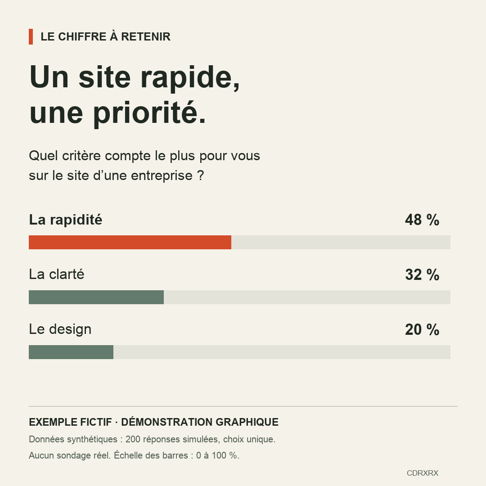
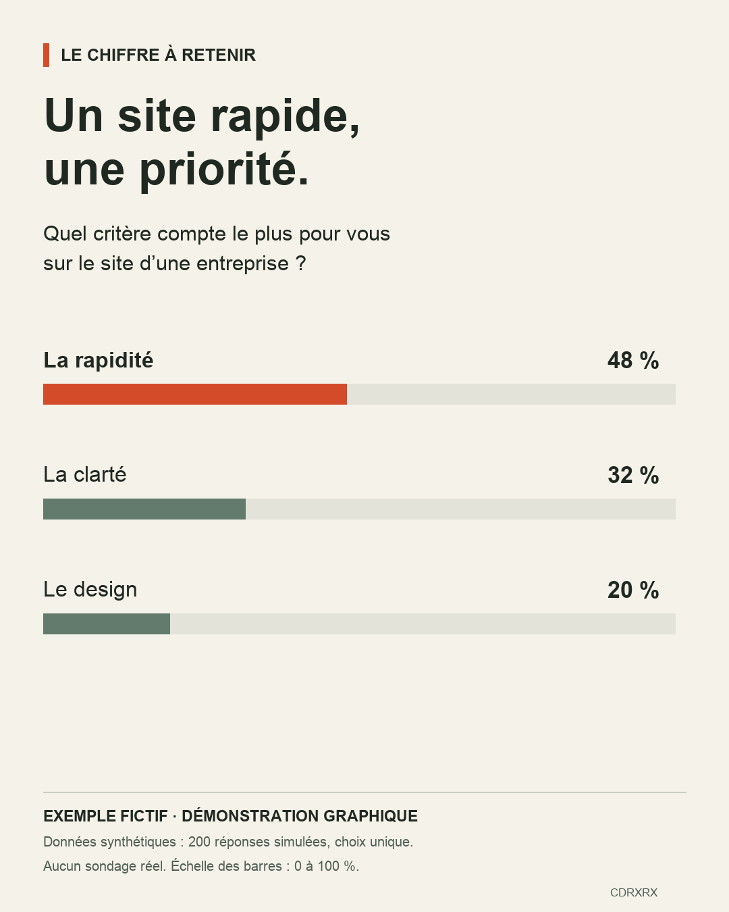

# Exemple de mise en forme de sondage

Démonstration indépendante CDRXRX. Données entièrement fictives : 200 réponses simulées, choix unique. Aucun résultat de sondage réel ni référence client.

Les barres partagent une échelle de 0 à 100 %. Sources SVG modifiables et script Python/Pillow inclus. Les PNG sont les aperçus de référence ; le rendu des polices SVG peut varier selon le lecteur.
